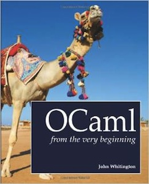
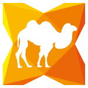

 # CSCI 1103 Computer Science I Honors

### Fall 2017

---

## Textbooks    

There is one required text for this course and two optional books. We will also post code and lecture notes. 

---

- [OCaml from the Very Beginning](http://ocaml-book.com/), by John Whitington. (**Required**)

 

This is a relatively easy introductory text.  A no-prerequisites approach to teaching a modern general-purpose programming language. Each small, self-contained chapter introduces a new topic in tutorial style, building until the reader can write quite substantial programs. There are plenty of questions and, crucially, worked answers and hints.

This book can be purchased at the BC Bookstore or from [Amazon](http://www.amazon.com/OCaml-Very-Beginning-John-Whitington/dp/0957671105%3FSubscriptionId%3D0ENGV10E9K9QDNSJ5C82%26tag%3Dcoherentpdfco-21%26linkCode%3Dxm2%26camp%3D2025%26creative%3D165953%26creativeASIN%3D0957671105) for about $35.

---

- [Real World OCaml: Functional Programming for the massess](https://realworldocaml.org/), by Yaron Minsky, Anil Madhavapeddy and Jason Hickey. (**Recommended**)

 

Real World OCaml takes you through the concepts of the language at a brisk pace, and then helps you explore the tools and techniques that make OCaml an effective and practical tool.

This book can be purchased through [Amazon](https://www.amazon.com/Real-World-OCaml-Functional-programming/dp/144932391X) for about $37.

---

- [Introduction to Objective Caml (Draft)](pdf//Hickey.pdf), by Jason Hickey. (**Recommended**)

 

This is a draft book that Jason Hickey wrote several years ago while at CalTech.  The organization of our course follows the outline of the book in broad outline but not in detail. This book is free!

