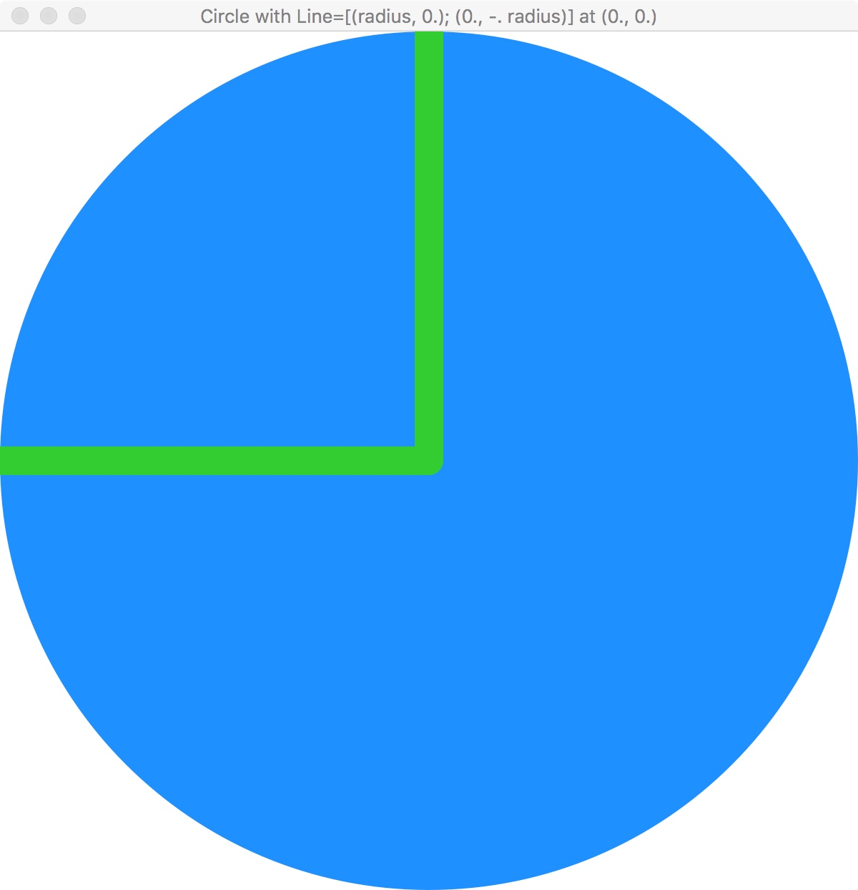

# CSCI 1103 Computer Science I Honors

### Fall 2017

------

## Notes on the Universe Graphics & Animation Library (DRAFT)

### Getting Started

OCaml's Standard Library is excellent but quite small as libraries go. So in CSCI 1103, we'll be using a non-standard library supporting simple graphics and animation. The library, called [Universe](http://www.is.ocha.ac.jp/~asai/Universe/en/), was developed by Kenichi Asai and Chihiro Uehara. It is based on a similar library developed earlier for the programming language Racket. 

This document gives a very brief overview of how the Universe library works. The library contains 3 main parts (modules): 1. World, 2. Image and 3. Color. In the present draft we're going to omit discussion of the World module and its `World.big_bang` function. We'll flesh that out in a subsequent draft.

### Graphics

 In this section we'll focus on graphical images. The graphics system used in the library is based on a 2D plane with x-coordinates running from left to right and y-coordinates running from top to bottom. So (0., 0.) is the point at the upper left and (width, height) is the point at the lower right. 

The [Image](http://www.is.ocha.ac.jp/~asai/Universe/en/Image.html) module contains functions that produce basic images: lines, circles, rectangles and polygons. For example, the illustration labelled *Circle* below was created as follows:

```ocaml
let radius = 300.
let circle = Image.circle radius Color.dodgerBlue
```

Notice that the `Image.circle` function accepts a radius and a color as arguments. There are many predefined colors in the [Color](http://www.is.ocha.ac.jp/~asai/Universe/en/Color.html) module as well as functions for making custom colors.

Images are built-up compositionally: given an image A and an image B, we can obtain a new image C by placing B on A. In the image *Square placed on Circle*, we've placed an image of a rectangle (in particular, a square) on top of a circle. Where is it placed? Each image can be though of as being drawn on a rectangular plane. The upper left corner of that plane (sometimes called the "pinhole") governs the placement of the image on some other image. *Square placed on Circle* was produced as follows:

```ocaml
let radius = 300.
let circle = Image.circle radius Color.dodgerBlue

let square = Image.rectangle radius radius Color.limeGreen
let image = Image.place_image square (radius, radius) circle
```

Notice that the `Image` module has a composing function `place_image`, such that a call

```ocaml
Image.place_image topImage (x, y) bottomImage
```

yields a new image that has `topImage` placed with it's pinhole at position `(x, y)` on `bottomImage`. 

|  |  |  |
| :--------------------------------------: | :--------------------------------------: | :--------------------------------------: |
|                  Circle                  | Square placed on Circle at (radius, radius) | Line [(radius, 0.)] placed at (radius, radius) |
|  |  |  |
| Line [(radius, 0.); (0., -. radius)] at (radius, radius) |       Same Line placed at (0., 0.)       |         Square with alpha = 200          |

Lines are a little tricky at first. A line is multi-segmented and is specified as a list of xy-displacements. For example,

```ocaml
let radius = 300.
let circle = Image.circle radius Color.dodgerBlue

let line = Image.line [(radius, 0.)] ~size:20 Color.limeGreen
let image = Image.place_image line (radius, radius) circle
```

makes an image of a horizontal line of width 20 pixels and length `radius` and places it on the circle at point`(radius, radius)`.

The pairs of numbers in the argument list are not specifications of points but rather displacements: `(radius, 0.)` means: this segment is obtained by traveling from the present point to the point `radius` units to the right and `0.` units down. 

The image on the lower left of the 6 illustrations was created as follows:

```ocaml
let radius = 300.
let circle = Image.circle radius Color.dodgerBlue

let line = Image.line [(radius, 0.); (0., -. radius)] ~size:20 Color.limeGreen
let image = Image.place_image line (radius, radius) circle
```

Notice that the pinhole of the two-segment line is at the invisible point at the extreme left and the extreme top of the collection of points making up the line. Put another way, imagine drawing the smallest rectangle containing all of the points of the line. The upper left corner of this invisible rectangle is the position of the pinhole for the image of the line. The same idea holds for polygons created with the `Image.polygon` function.

The illustration *Same Line placed ...* above is, as the caption indicates, the same two-segment line but with the pinhole of the line placed at at the upper left point, i.e., at point `(0., 0.)` of the circle.

Finally, the illustration *Square with alpha …* shows the placement of a partially translucent green square on top of the blue circle. It was created as follows:

```ocaml
let radius = 300.
let circle = Image.circle radius Color.dodgerBlue

let (r, g, b) = Color.to_rgb Color.limeGreen          (* find the red, green, blue in limeGreen *)
let seeThroughLimeGreen = Color.make_color ~alpha:200 r g b
let square = Image.rectangle radius radius seeThroughLimeGreen
let image = Image.place_image square (radius, radius) circle
```

### Animation

LATER
