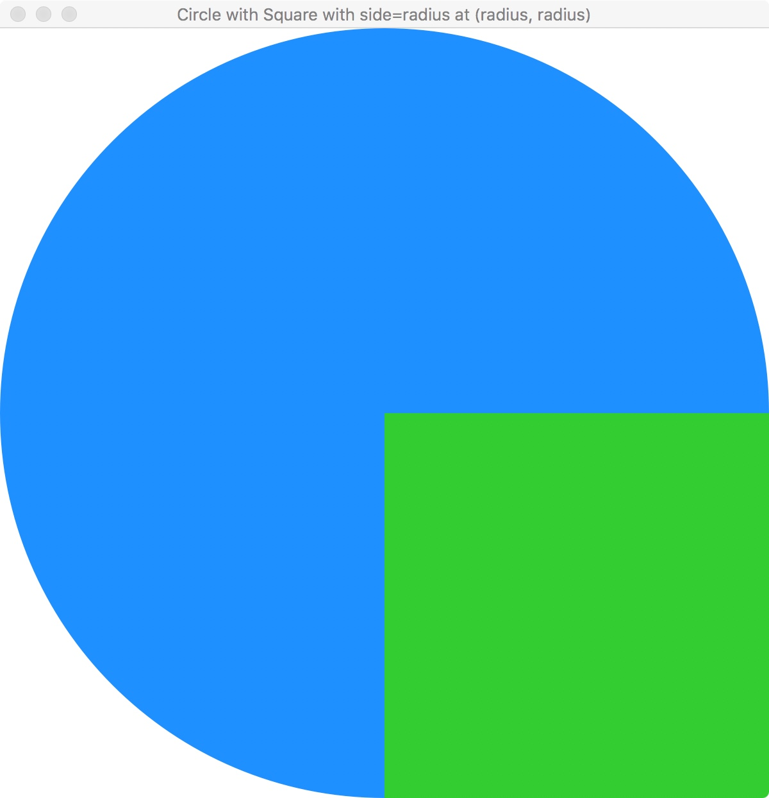
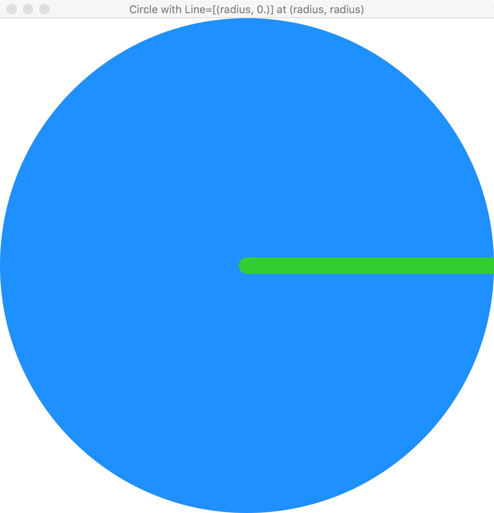
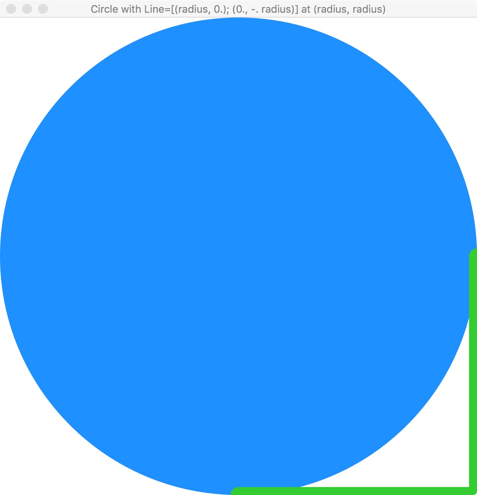

# CSCI 1103 Computer Science I Honors

### Fall 2017

------

## Notes on the Universe Graphics & Animation Library (DRAFT)

### Getting Started

OCaml's Standard Library is excellent but quite small as libraries go. So in CSCI 1103, we'll be using a non-standard library supporting simple graphics and animation. The library, called [Universe](http://www.is.ocha.ac.jp/~asai/Universe/en/), was developed by Kenichi Asai and Chihiro Uehara. It is based on a similar library developed earlier for the programming language Racket. 

This document gives a very brief overview of how the Universe library works. The library contains 3 main parts (modules): 1. World, 2. Image and 3. Color. 

### Color

The Universe library contains a [Color](http://www.is.ocha.ac.jp/~asai/Universe/en/Color.html) module with a large number of pre-defined colors. Colors are combinations of varying levels of *red*, *green* and *blue*. In addition, a color may have an alpha value which determines the transparency of a color. An alpha value of 255 is completely opaque. An alpha value of 0 is completely transparent.

The Color module contains one function for making colors and two functions for taking them apart:

```ocaml
make_color : ?alpha:int -> int -> int -> int -> t
The call (make_color r g b ~alpha:a) creates a color from RGB and optional alpha (default: 255)

to_rgba : t -> int * int * int * int
The call (to_rgba color) extracts RGBA from a color

to_rgb : t -> int * int * int
The call (to_rgb color) extracts RGB from a color ignoring alpha
```

The integer values specifying the red, green, blue and alpha range between 0 and 255. When all of red, green and blue are 0, the color is black. When they're all 255 the color is white. And more generally, any color with equal levels of red, green and blue provides a shade of gray.

### Images and the Graphics Display

 In this section we'll focus on graphical images. The graphics system used in the library is based on a 2D plane with x-coordinates running from left to right and y-coordinates running from top to bottom. So (0., 0.) is the point at the upper left and (width, height) is the point at the lower right. 

The [Image](http://www.is.ocha.ac.jp/~asai/Universe/en/Image.html) module contains functions that produce basic images: lines, circles, rectangles and polygons. For example, the illustration labelled *Circle* below was created as follows:

```ocaml
let radius = 300.
let circle = Image.circle radius Color.dodgerBlue
```

Notice that the `Image.circle` function accepts a radius and a color as arguments. There are many predefined colors in the [Color](http://www.is.ocha.ac.jp/~asai/Universe/en/Color.html) module as well as functions for making custom colors.

Images are built-up compositionally: given an image A and an image B, we can obtain a new image C by placing B on A. In the image *Square placed on Circle*, we've placed an image of a rectangle (in particular, a square) on top of a circle. Where is it placed? Each image can be though of as being drawn on a rectangular plane. The upper left corner of that plane (sometimes called the "pinhole") governs the placement of the image on some other image. *Square placed on Circle* was produced as follows:

```ocaml
let radius = 300.
let circle = Image.circle radius Color.dodgerBlue

let square = Image.rectangle radius radius Color.limeGreen
let image = Image.place_image square (radius, radius) circle
```

Notice that the `Image` module has a composing function `place_image`, such that a call

```ocaml
Image.place_image topImage (x, y) bottomImage
```

yields a new image that has `topImage` placed with it's pinhole at position `(x, y)` on `bottomImage`. 

|  |  |  |
| :--------------------------------------: | :--------------------------------------: | :--------------------------------------: |
|                  Circle                  | Square placed on Circle at (radius, radius) | Line [(radius, 0.)] placed at (radius, radius) |
|  |  |  |
| Line [(radius, 0.); (0., -. radius)] at (radius, radius) |       Same Line placed at (0., 0.)       |         Square with alpha = 200          |

Lines are a little tricky at first. A line is multi-segmented and is specified as a list of xy-displacements. For example,

```ocaml
let radius = 300.
let circle = Image.circle radius Color.dodgerBlue

let line = Image.line [(radius, 0.)] ~size:20 Color.limeGreen
let image = Image.place_image line (radius, radius) circle
```

makes an image of a horizontal line of width 20 pixels and length `radius` and places it on the circle at point`(radius, radius)`.

The pairs of numbers in the argument list are not specifications of points but rather displacements: `(radius, 0.)` means: this segment is obtained by traveling from the present point to the point `radius` units to the right and `0.` units down. 

The image on the lower left of the 6 illustrations was created as follows:

```ocaml
let radius = 300.
let circle = Image.circle radius Color.dodgerBlue

let line = Image.line [(radius, 0.); (0., -. radius)] ~size:20 Color.limeGreen
let image = Image.place_image line (radius, radius) circle
```

Notice that the pinhole of the two-segment line is at the invisible point at the extreme left and the extreme top of the collection of points making up the line. Put another way, imagine drawing the smallest rectangle containing all of the points of the line. The upper left corner of this invisible rectangle is the position of the pinhole for the image of the line. The same idea holds for polygons created with the `Image.polygon` function.

The illustration *Same Line placed ...* above is, as the caption indicates, the same two-segment line but with the pinhole of the line placed at at the upper left point, i.e., at point `(0., 0.)` of the circle.

Finally, the illustration *Square with alpha …* shows the placement of a partially translucent green square on top of the blue circle. It was created as follows:

```ocaml
let radius = 300.
let circle = Image.circle radius Color.dodgerBlue

let (r, g, b) = Color.to_rgb Color.limeGreen          (* find the red, green, blue in limeGreen *)
let seeThroughLimeGreen = Color.make_color ~alpha:200 r g b
let square = Image.rectangle radius radius seeThroughLimeGreen
let image = Image.place_image square (radius, radius) circle
```

### BitMap Images

LATER

### Animation and the World Module

The [World](http://www.is.ocha.ac.jp/~asai/Universe/en/World.html) module in the Universe library allows one to code interactive graphical applications in OCaml using a variation of the [model-view-update](https://guide.elm-lang.org/architecture/) software architecture (aka the [Elm](http://elm-lang.org/) software architecture). The model-view-update architecture is a modern take on the [model-view-controller](https://en.wikipedia.org/wiki/Model%E2%80%93view%E2%80%93controller) architecture which was used in the heyday of object-oriented programming. The basic idea of model-view-update is that the state of a graphical application is represented or modeled using a single value — in this architecture the value is called a *model*. For a non-trivial application the model will usually be a record structure with many parts. The model-view-update architecture is implemented in a cycle with the model being passed to a *view* function which produces a graphical representation of the model for the user to see. When events such as *clock-ticks*, *touchpad actions* or *keystrokes* occur, the model is threaded through an *update* function which produces a new model reflecting the changed state of the app.

```
                                      +------------+
                  +-------------------+    view    |<-------------------+
                  |                   +------------+                    |
                  v                                                     |
          +----------------+                                   +--------+-------+
          |     events     |                                   |      model     |
          +-------+--------+                                   +----------------+
                  |                                                     ^
                  |                   +------------+                    |
                  +------------------>|   update   +--------------------+
                                      +------------+
```

In the general Elm architecture, all of the different types of events are threaded through a single update function.

```ocaml
update : Msg Model -> Model
```

And the `update` function uses the `Msg` to sort out which kind of event occurred and how to map the input model to the output model. 

In the Universe library, the `World.big_bang` function handles the three types of events mentioned above (i.e., clock ticks, touchpad actions and key-strokes) separately. A typical application might look like this:

```ocaml
World.big_bang initialModel
  ~name: "My App"
  ~width: 500
  ~height: 500
  ~to_draw: view
  ~rate: 0.02
  ~on_tick: clockUpdate
  ~on_mouse: mouseUpdate                 (* ('a -> float -> float -> string -> ('a, 'c) t) *)
  ~on_key_press: keyPressUpdate          (* ('a -> string -> ('a, 'd) t) *)
  ~on_key_release: keyReleaseUpdate      (* ('a -> string -> ('a, 'd) t) *)
  ~stop_when: finished
  ~to_draw_last: view
```

Let us assume that the coder has defined a suitable `model` type:

```ocaml
type model = ...
```

The `World.big_bang` function has one required input and several optional inputs. It operates in a loop:

- The `initialModel` is the starter value of type `model`. This value is threaded through the `big_bang` loop;
- The `to_draw` function `view : model -> Image.t` is called each time through the loop, it produces an image that the `big_bang` function displays;
- The `rate` is the clock rate, here set to `0.02` two one-hundredths of a second;
- The `on_tick` function `clockUpdate : model -> model` is the update function specifically for clock-tick events, it is called each time through the `big_bang`'s loop; SEE BELOW ABOUT ITS RETURN VALUE!
- The touchpad/mouse function `mouseUpdate : model -> x -> y -> event -> model` is called whenever an event occurs on the touchpad/mouse. The `mouseUpdate` function accepts a model, the (x, y) coordinates of the touchpad/mouse event and a string representing the kind of event. From these inputs it produces a new model. There are only two touchpad/mouse events:
  - "button_down"
  - "button_up"
- There are two key management functions: `on_key_press` and `on_key_release`. These work analogously so we'll just describe `on_key_press`, the function `keyPressUpdate : model -> event -> model` accepts a model and a key name in the form of a string. It produces a new model. For a given key, the string name is a string representing the symbol on the key — "a" or "A". The arrow keys are named as one would expect:
  - "left", "right", "up" and "down"
- The `stop_when` function `finished : model -> bool` is applied to the model. If it returns `true` the `big_bang` function will call the `to_draw_last : model -> Image.t` function and terminate the loop.
- The `to_draw_last` function operates like `to_draw` but it allows for a final image that is different than the images displayed in the `big_bang` loop.

It isn't exactly accurate, but the `World.big_bang` function can be understood roughly as:

```ocaml
let big_bang model ~to_draw:view ~on_tick:update ~stop_when:finished ~to_draw_last:lastView =
  let rec loop model =
    let image = view model in
    let _ = display image                         (* Renders the image on the display *)
    in
    match finished model with
    | true  -> display (lastView model)
    | false -> loop (update model)
  in
  loop model
```

### Heads Up!

Conceptually, the various `update` functions map models to models. However, due to the inclusion of additional features in the Universe library, the models returned by the various update functions must be wrapped with the `World` constructor from the `World` module. (Confusing, I know.) Here is an example:

```ocaml
type model = { x : float }

let update model = World.World { x = 3.14 }
```

The `World.World` constructor packages up the model in a variant type that is required to make the plumbing of the `World.big_bang` function well-typed.